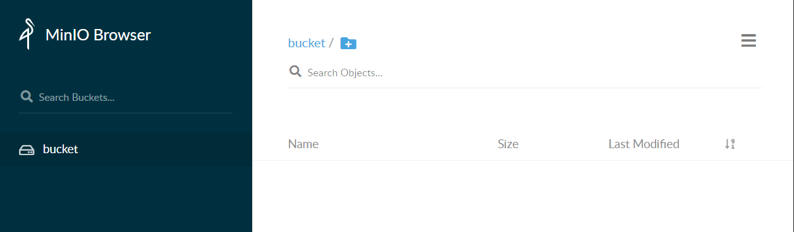

[TOC]
# MinIO-COS-AWS

# 背景

最近项目在做私有化交付，涉及到兼容 COS 和 minIO 两种存储方案，这里做下总结。

项目大致分为**私有化**和**公有云**两个版本，其中私有化版本存储方案采用 **minIO**，公有云版本存储方案为 **COS**。为了兼容这两套存储方案，同时避免引入多分支开发，调研兼容方案——**AWS（Amazon Web Services）**。无论是 minIO 还是 COS 都遵循 AWS 协议，这样就可以一套代码同时兼容 minIO 和 COS 。

# minIO
### 参考文档

* [Minio Cookbook 中文版](https://www.bookstack.cn/books/MinioCookbookZH)
* [minio Github](https://github.com/minio/minio)
* [API和demo](https://docs.min.io/docs/javascript-client-quickstart-guide.html)

### windows部署

* 下载[minio客户端](https://dl.min.io/server/minio/release/windows-amd64/minio.exe)
* 运行命令在当前目录下部署 store 作为minio环境
```
$ ./minio.exe server store
IAM initialization complete
Endpoint: http://10.76.159.70:9000  http://169.254.199.21:9000  http://192.168.255.10:9000  http://192.168.116.1:9000  http://192.168.152.1:9000  http://127.0.0.1:9000
RootUser: minioadmin 
RootPass: minioadmin 

Browser Access:
   http://10.76.159.70:9000  http://169.254.199.21:9000  http://192.168.255.10:9000  http://192.168.116.1:9000  http://192.168.152.1:9000  http://127.0.0.1:9000

...
```
* 在浏览器打开验证

在上一步运行部署命令时，控制台输出了浏览器访问的地址和默认用户名密码，在浏览器登录验证即可。

创建的是默认的用户名和密码，也可以更改用户名密码。设置环境变量 MINIO_ROOT_USER 和 MINIO_ROOT_PASSWORD。


### Demo开发


* 安装npm依赖
```
$ npm i minio --save
```
* minio初始化
```
const Minio = require('minio')

const minioClient = new Minio.Client({
    endPoint: '10.76.159.70',
    port: 9000,
    useSSL: false,  // false: use http; true:use https
    accessKey: 'minioadmin',
    secretKey: 'minioadmin'
});
```

* 文件上传和下载
```
const myBucket = 'bucket';
const file = 'file-to-upload.jpg';

// upload file
(function() {
    var metaData = {
        'Content-Type': 'application/octet-stream',
    }
    minioClient.fPutObject(myBucket, file, file, metaData, function (err, etag) {
        if (err) return console.log(err);
        console.log(`Upload file ${file} successfully`);
    });
})();

// download file
(function () {
    minioClient.fGetObject(myBucket, file, `downloaded-${file}`, function (err) {
        if (err) return console.log(err);
        console.log(`Download file ${file} successfully`);
    })
})();

```
全部的demo可以查看minio文件夹，这个demo只是本地部署测试，没有考虑到安全问题。后面会介绍接入鉴权的实践。

    注意：运行demo时确保minio服务运行。

# COS
COS 用的是腾讯云的 COS 服务。之前 minio 的 demo 是本地部署，没有考虑安全问题，比如用户名和密码不应该放到前端，需要接入鉴权等。腾讯云cos是收费服务，鉴权是必不可少的步骤。

腾讯云官方推荐的[最佳实践](https://cloud.tencent.com/document/product/436/31923)。COS 使用临时密钥服务时，可以为不同的 COS API 操作配置不同的操作权限。所以后端主要的工作就是**权限策略配置**和**临时密钥签发**。前端向后端请求临时密钥再进行 COS 操作。
### 参考文档

* [腾讯云cos](https://cloud.tencent.com/document/product/436/6240)
关于注册购买和使用直接看官网文档比较全面，这里不赘诉。
* [cos后端github](https://github.com/tencentyun/qcloud-cos-sts-sdk)
* [cos前端github](https://github.com/tencentyun/cos-js-sdk-v5)

### Demo 后端开发
官网介绍 

* 安装npm依赖
```
$ npm i qcloud-cos-sts --save
```
* API 授权策略配置
[官方文档](https://cloud.tencent.com/document/product/436/31923)
```
const policy = {
  version: '2.0',
  statement: [{
    action: [
      // Refs https://cloud.tencent.com/document/product/436/31923
      'name/cos:PutObject',
      'name/cos:GetObject',
      'name/cos:GetObjectUrl',
    ],
    effect: 'allow',
    resource: [
      '*',
    ],
  }],
};
```
* 生成临时密钥
```
async function getCosAuthorization() {
  return new Promise((resolve) => {
    STS.getCredential({
      secretId: config.secretId,
      secretKey: config.secretKey,
      policy,
      durationSeconds: config.expireTime,
      proxy: '',
      region: config.region,
    }, (err, data) => {
      if (err) {
        return resolve({
          code: -1000,
          errMsg: `Get COS authorization fail ${err}`,
        });
      }
      const { credentials, expiredTime } = data;
      const result = {
        code: 0,
        errMsg: '',
        data: {
          TmpSecretId: credentials.tmpSecretId,
          TmpSecretKey: credentials.tmpSecretKey,
          XCosSecurityToken: credentials.sessionToken,
          ExpiredTime: expiredTime,
        },
      };
      return resolve(result);
    });
  });
}
```

### Demo 前端开发

* 安装npm依赖
```
$ npm install cos-js-sdk-v5 --save
```


* cos初始化

```
const cosClient = new COS({
    getAuthorization: function (options, callback) {
        cosAuthorization()
            .then((res) => {
                if (res.errCode === 0 && res.data) {
                    var data = res.data;
                    var params = {
                        TmpSecretId: data.TmpSecretId,
                        TmpSecretKey: data.TmpSecretKey,
                        XCosSecurityToken: data.XCosSecurityToken,
                        ExpiredTime: data.ExpiredTime, // SDK 在 ExpiredTime 时间前，不会再次调用 getAuthorization
                    };
                    callback(params);
                }
            })
            .catch((err) => {
                console.log(err);
            });
    },
});
```

全部的demo可以查看cos文件夹，包含前端和后端的代码。


# AWS

项目最终方案采用 AWS，目标是兼容 minIO 和 COS 两套存储方案。这里介绍下 AWS 访问 minio 和 COS 以及简单操作的 Demo。

关于安全问题， AWS 提供 getPresignedURL 机制。前端想要操作某对象时，需要先向后端请求操作该对象的临时签名URL。

### 参考文档

* [AWS 官网](https://docs.aws.amazon.com/AmazonS3/latest/userguide/Welcome.html)
* [腾讯云 COS 使用 AWS 访问](https://cloud.tencent.com/document/product/436/37421)
* [minio 使用 AWS 访问](https://docs.min.io/docs/how-to-use-aws-sdk-for-javascript-with-minio-server.html)

### Demo 后端开发
* 安装npm依赖
```
$ npm i aws-sdk --save
```

* 依据部署的存储方案类型 config.storage 来初始化 AWS。
```
if (config.storage === 'minio') {
  s3Client = new AWS.S3({
    accessKeyId: config.minio.accessKeyId,
    secretAccessKey: config.minio.secretAccessKey,
    endpoint: config.minio.endpoint,
    s3ForcePathStyle: true, // needed with minio?
    signatureVersion: 'v4',
  });
  bucket = config.minio.bucket;
  expireTime = config.minio.expireTime;
} else {
  s3Client = new AWS.S3({
    accessKeyId: config.cos.secretId,
    secretAccessKey: config.cos.secretKey,
    endpoint: config.cos.endpoint,
    s3ForcePathStyle: true, // needed with minio?
    signatureVersion: 'v4',
    sslEnabled: true
  });
  bucket = config.cos.bucket;
  expireTime = config.cos.expireTime;
}
```
* 生成临时签名的URL

这里在返回 presignedURL 的同时返回了对象资源的地址--resourceURL，resourceURL是根据规则拼接生成。
```
async function getPresignedUrl(req) {
  try {
    const { fileKey, operation } = req;
    let params = {
      Bucket: bucket,
      Key: fileKey,
      Expires: expired
    };
    if (operation.indexOf('put') >= 0) {
      params["ContentType"] = "application/octet-stream";
    }
    const presignedURL = await s3Client.getSignedUrlPromise(operation, params);
    let resourceURL;
    if (config.storage === 'minio') {
      resourceURL = `${minio.minio.endpoint}${config.minio.bucket}/${req.fileKey}`
    } else {
      resourceURL = `https://${config.cos.endpoint}/${config.cos.bucket}/${req.fileKey}`;
    }
    return {
      errCode: 0,
      errMsg: '',
      data: { presignedURL, resourceURL }
    };
  } catch (error) {
    return {
      errCode: 1000,
      errMsg: `getPresignedUrl fail ${error}`,
      data: {}
    }
  }
}
```
### Demo 前端开发
因为 AWS 采用临时签发URL的策略，这样前端就不用再安装 aws sdk，直接向后端请求 presignedURL，然后通过 axios 上传或下载文件就好，全部代码可以查看aws文件夹。

* 上传文件
```
export function uploadFileWithKey(key, file, progressCallback, cancelTokenCallback) {
  return new Promise(async(resolve, reject) => {
    try {
      if (!key || !file) {
        throw new Error('uploadFileWithKey params: key or file is invalid');
      }

      if (progressCallback && typeof progressCallback !== 'function') {
        throw new TypeError('progressCallback must be a function.');
      }

      if (cancelTokenCallback && typeof cancelTokenCallback !== 'function') {
        throw new TypeError('cancelTokenCallback must be a function');
      }

      const { presignedURL, resourceURL } = await getPresignedUrl('putObject', key);
      if (!checkUrl(presignedURL) || !checkUrl(resourceURL)) {
        throw new Error('getPresignedUrl error');
      }

      const CancelToken = axios.CancelToken;
      const source = CancelToken.source();
      if (cancelTokenCallback) {
        cancelTokenCallback(source);
      }

      const config = {
        headers: { 'Content-Type': file.type },
        onUploadProgress: (event) => {
          const progress = event.loaded / event.total;
          if (progressCallback) {
            progressCallback(progress);
          }
        },
        cancelToken: source.token,
      };
      await axios.put(presignedURL, file, config);
      resolve({ resourceURL, resourceKey: key });
    } catch (error) {
      if (axios.isCancel(error)) {
      } else {
        reject(error);
      }
    }
  });
}
```

# 题外话

### File key

File key是文件的标识，主要的考虑是不要同名，且同名文件不要互相覆盖，所以最后采用时间串的md5。

### 上传进度和取消

AWS 的demo采用axois上传文件，这里封装了上传进度和取消的逻辑。在调用  ``` uploadFileWithKey ``` 接口后两个参数就是 progressCallback 和 cancelTokenCallback。

